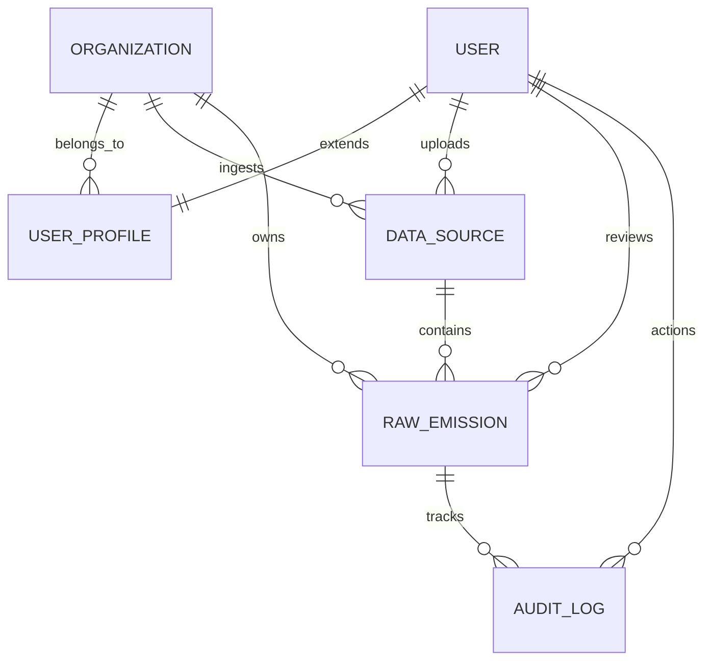

# Data Model Design

This document details the database schema and architectural decisions for multi-tenancy, Scope 1/2/3 categorization, source-of-truth tracking, unit normalization, and audit trails.

---

## 1. Entity Relationship Diagram



---

## 2. Schema Details

The database is built on a relational design optimized for compound query filters, historical auditing, and separation of raw data imports from aggregate calculations.

### Organization
The core tenant container. All transactional data must be partitioned under an organization.
*   `id` (UUID, Primary Key): Globally unique identifier.
*   `name` (VARCHAR): Legal name of the company.
*   `email_domain` (VARCHAR, Unique): Used for domain-matching auto-assignment or verification.
*   `created_at` / `updated_at` (DateTime)

### UserProfile
Extends the standard Django auth user to enforce roles and organization boundaries.
*   `id` (UUID, Primary Key)
*   `user` (ForeignKey → Django User, cascade): One-to-one mapping.
*   `organization` (ForeignKey → Organization, cascade)
*   `role` (VARCHAR): Role choice of `ADMIN`, `ANALYST`, or `VIEWER`.

### DataSource
Tracks ingestion events. Serves as the origin ledger for all emissions rows.
*   `id` (UUID, Primary Key)
*   `organization` (ForeignKey → Organization, cascade)
*   `source_type` (VARCHAR): Origin source class (`SAP`, `UTILITY`, `TRAVEL`).
*   `filename` (VARCHAR): Name of the uploaded file or source format.
*   `ingested_at` (DateTime, auto_now_add)
*   `ingested_by` (ForeignKey → Django User, set_null)
*   `record_count` (INT): Total number of rows parsed in the run.
*   `notes` (TEXT): Runtime logs or ingest notes.

### RawEmission
Normalized emissions record. Represents a single activity block (e.g. 1 month of electricity, a single travel segment, or a fuel purchase order).
*   `id` (UUID, Primary Key)
*   `organization` (ForeignKey → Organization, cascade)
*   `data_source` (ForeignKey → DataSource, set_null): Traceability back to the specific ingest run.
*   `source_reference_id` (VARCHAR): Row identifier from the origin source (e.g., SAP `PO#`, utility `Meter ID_Date`, travel expense ID).
*   `activity_date` (Date): Date of consumption/purchase.
*   `activity_type` (VARCHAR): Original category (e.g., `FUEL_DIESEL`, `ELECTRICITY`, `FLIGHT_BUSINESS`).
*   `activity_value` (DECIMAL): Normalized consumption value.
*   `activity_unit` (VARCHAR): Standardized unit of consumption (e.g., `kg`, `kWh`, `km`, `nights`).
*   `scope` (VARCHAR): `SCOPE_1`, `SCOPE_2`, or `SCOPE_3`.
*   `category` (VARCHAR): Broad activity class (`FUEL`, `ELECTRICITY`, `FLIGHTS`, `HOTELS`, `GROUND_TRANSPORT`, `OTHER`).
*   `emission_factor` (DECIMAL): CO₂e factor utilized (kg CO₂e per unit).
*   `calculated_emissions_kg_co2e` (DECIMAL): `activity_value` × `emission_factor`.
*   `status` (VARCHAR): Approval status: `NEW`, `REVIEWED`, `APPROVED`, `REJECTED`.
*   `reviewed_by` (ForeignKey → User, set_null): Analyst who signed off.
*   `reviewed_at` (DateTime, nullable)
*   `rejection_reason` (TEXT): Justification notes if rejected.
*   `analyst_notes` (TEXT): Workpapers, corrections, and geographic lookup descriptions.
*   `validation_issues` (JSONField): Array of warnings generated during ingestion (e.g., gap alerts, high consumption).

### AuditLog
Immutable ledger recording all system modifications.
*   `id` (UUID, Primary Key)
*   `emission` (ForeignKey → RawEmission, cascade)
*   `action` (VARCHAR): `CREATED`, `UPDATED`, `APPROVED`, `REJECTED`, `NOTES_ADDED`.
*   `changed_by` (ForeignKey → Django User, set_null)
*   `changes` (JSONField): Audit dictionary containing `{field: {old: x, new: y}}`.
*   `timestamp` (DateTime, auto_now_add)
*   `notes` (TEXT)

---

## 3. Core Architectural Mechanisms

### A. Multi-Tenancy Isolation
Multi-tenancy is implemented logically via Shared Database, Shared Schema, separated by Organization Foreign Key:
1.  **Strict Django ViewSet Query Filters**: 
    Every API ViewSet filters by the current user's organization:
    ```python
    def get_queryset(self):
        return RawEmission.objects.filter(organization=self.request.user.profile.organization)
    ```
2.  **Organization Validation**:
    Serializers prevent manual injection of other organization IDs by omitting organizations from writable input or automatically setting them during create runs:
    ```python
    emission.organization = request.user.profile.organization
    ```
3.  **Permission Enforcement**:
    The `IsInOrganization` custom permission class ensures that a user cannot retrieve, patch, or delete objects belonging to other tenants.

### B. GHG Protocol Scope 1/2/3 Categorization
Data streams are automatically routed to the correct scope based on their ingestion origin:
*   **Scope 1 (Direct Emissions)**: SAP fuel procurement is direct combustion. Activity data is converted to fuel mass (kg) and mapped to `SCOPE_1` / `FUEL`.
*   **Scope 2 (Indirect Energy)**: Utility meter records are purchased electricity. Aggregated by billing cycles and mapped to `SCOPE_2` / `ELECTRICITY`.
*   **Scope 3 (Other Indirect)**: Travel data (flights, hotels, transport) represents business travel. Mapped to `SCOPE_3` under categories `FLIGHTS`, `HOTELS`, and `GROUND_TRANSPORT`.

### C. Source-of-Truth & Lineage Tracking
1.  **Lineage Link**: Every emission row is directly linked to a `DataSource` parent, tracking exactly *which file*, *when*, and *by whom* the row was ingested.
2.  **Origin References**: The `source_reference_id` captures the unique identifier from the source system (e.g. SAP Purchase Order number), enabling simple audit lookups back to origin books.
3.  **Edit Indicator**: Any user modification updates the `updated_at` timestamp. Revisions generate an append-only `AuditLog` row showing the exact delta changes. If the history contains entries other than `CREATED`, the row is flagged as edited.

### D. Unit Normalization Engine
The platform automatically translates inconsistent input formats into standard metrics:
*   **Mass Conversion for Fuels**: SAP fuel inputs in Liters (`L`) or Gallons (`gal`) are converted using standard densities (Diesel = 0.84 kg/L, Petrol = 0.75 kg/L) to normalize to Kilograms (`kg`). Gallons are multiplied by `3.785` to convert to Liters before density calculations.
*   **Distance Conversions**: Corporate travel flights and ground transport segments in Miles are multiplied by `1.609` to standardize on Kilometers (`km`).
*   **Utility Aggregation**: Daily or weekly utility readings are aggregated into monthly billing cycles based on elapsed times between readings, avoiding the mismatch between utility read dates and calendar months.

### E. Immutable Audit Trail & Lock-in
1.  **State Machine**:
    ```
    [INGEST] ──> NEW (validation flags raised)
                  │
          ┌───────┴───────┐
          ▼               ▼
      APPROVED        REJECTED (requires justification reason)
      (LOCKED)
    ```
2.  **Approve Lock**: Once an analyst approves a record, the status transitions to `APPROVED`. The backend ViewSet permissions and serializer logic reject any subsequent modifications to the record's activity values, and the frontend renders the record as read-only.
3.  **Append-only History**: Any notes update, approval, or rejection writes a new immutable `AuditLog` row capturing the delta, creating a clear history suitable for auditors.
